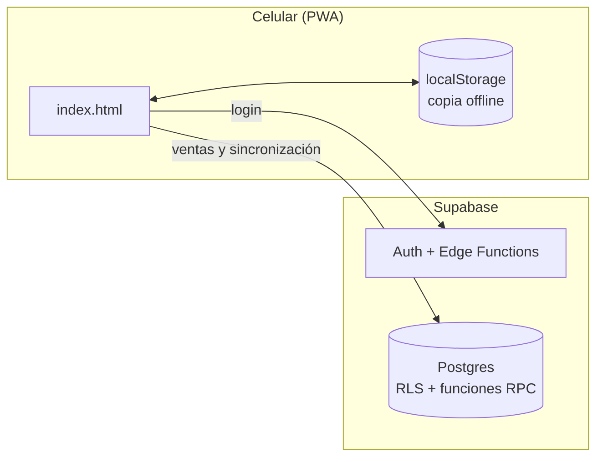
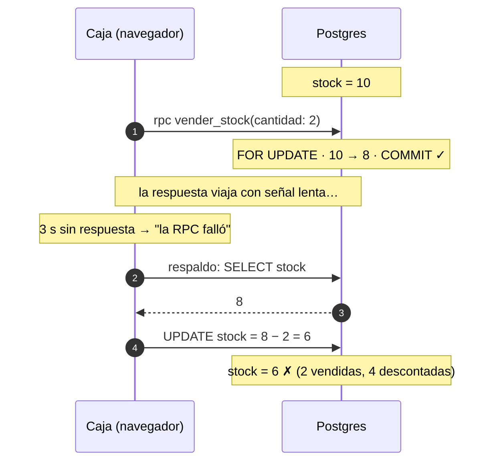
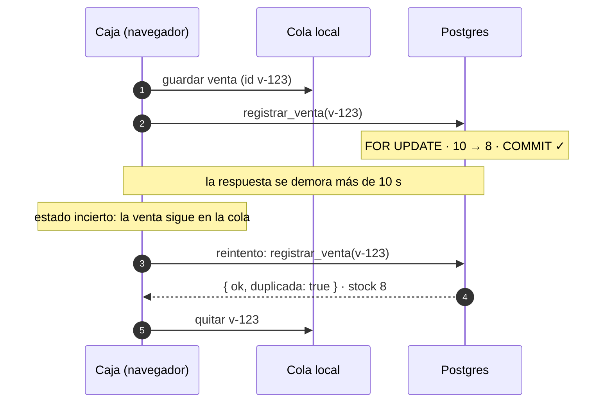

# POS offline-first para comercio de barrio

Un punto de venta pensado para almacenes y bazares atendidos por una o dos
personas, que venden **desde el celular**, sin computador en el mesón y con
una señal móvil que va y viene.

> Este repositorio es una versión pública del proyecto, para mostrar el
> diseño y el código. La URL del proyecto de Supabase, la llave publicable y
> la llave VAPID son valores de ejemplo (`TU-PROYECTO-REF`,
> `sb_publishable_TU_LLAVE_AQUI`, `TU_VAPID_PUBLIC_KEY`): no apunta a ninguna
> base de datos real.

## Qué hace

- **Caja:** ventas con efectivo, débito, crédito, transferencia, fiado o pago
  mixto; cálculo de vuelto; apertura y cierre de turno con arqueo.
- **Inventario con costo real:** cada compra entra como un lote y las ventas
  los consumen en orden FIFO, así la utilidad se calcula con el costo de lo que
  realmente se vendió. Escáner de códigos con la cámara y alertas de stock bajo.
- **Clientes y fiado:** el "cuaderno" de deudas, digital, con abonos.
- **Reportes** y exportación a Excel.
- **Funciona sin internet:** se puede seguir vendiendo sin señal y todo se
  sincroniza al volver la conexión.
- **Aviso al celular de la dueña** con cada venta (Web Push).
- **Dos roles:** administradora (todo) y vendedora (solo ventas y caja).

## Arquitectura

No hay servidor propio ni proceso de build: la app es un solo `index.html`
(HTML, CSS y JavaScript sin frameworks) que se instala como PWA en el celular.
El backend es Supabase.



- **Hosting:** cualquier hosting estático (el proyecto original usa
  Cloudflare Pages).
- **Datos:** el catálogo, los clientes, los lotes, los turnos y los usuarios
  viven como arreglos JSON en una tabla clave/valor (`app_data`). El historial
  de ventas y movimientos va en tablas propias, una fila por registro, donde
  solo se agregan filas.

### Cómo funciona sin internet

Cada dispositivo guarda una copia de los datos en `localStorage`. Cuando hay
conexión, cada cambio se sube con **bloqueo optimista** (`updated_at`): si otro
dispositivo escribió primero, se vuelve a leer y se **fusiona**.

La fusión es a tres vías: compara la versión local, la de la nube y la última
versión sincronizada (la "base"), y cada dispositivo aporta solo los campos que
cambió. Los campos que se acumulan (stock, saldo de fiado, cantidad restante de
un lote) se **suman** en vez de pisarse.

Las **ventas** no viajan por esa fusión: van a una cola en el dispositivo y se
registran en el servidor con una función transaccional e idempotente (ver
"Concurrencia de una venta").

## Seguridad

La llave publicable de Supabase va en el navegador; es pública por diseño. Lo
que protege los datos está en la base:

- **Sesiones reales.** El login se ve simple (eliges tu nombre y escribes tu
  clave), pero la clave la valida en el servidor la Edge Function
  `iniciar-sesion`, con bloqueo tras 5 intentos. Si es correcta, entrega una
  sesión de Supabase Auth cuyo token lleva el id de la persona en
  `app_metadata`, un campo que solo el servidor puede escribir.
- **El rol lo decide la base.** En cada consulta, `fn_rol_actual()` busca el
  rol de quien llama en la lista de usuarios. Si la administradora desactiva a
  alguien, pierde el acceso en ese momento.
- **RLS por rol.** Sin sesión solo se puede leer la lista de nombres que
  muestra el login. La vendedora solo puede abrir y cerrar caja y editar su
  propio perfil; sus ventas pasan por `registrar_venta`. El resto, solo la
  administradora. Un trigger impide que alguien que no es
  administradora cree usuarios o cambie roles, aunque escriba directo a la API.
- **Claves.** Se guardan con PBKDF2 en tablas sin acceso desde la API.
  Cambiar una clave exige sesión. Para recuperar el acceso (pregunta secreta,
  código maestro o código por correo/SMS), la prueba viaja **junto** con la
  clave nueva y el servidor la vuelve a validar antes de guardarla.
- **Límite de llamadas** en las funciones expuestas.

El detalle y las pruebas están en
`supabase/migrations/20260101000009_autenticacion_real.sql`.

## Concurrencia de una venta

Lo documenté en dos partes: primero el problema y después la solución, ambos
reproducidos y medidos contra la app publicada.
El código tal como estaba en cada parte quedó etiquetado:
[`parte-1`](https://github.com/Joakin333/pos-showcase/tree/parte-1) (el bug) y [`parte-2`](https://github.com/Joakin333/pos-showcase/tree/parte-2) (la solución).

### El problema

El stock se descontaba en el servidor con `SELECT … FOR UPDATE`, que pone en
fila las ventas simultáneas. Pero el navegador esperaba esa respuesta solo 3
segundos (`Promise.race`). Si se agotaba, asumía que había fallado y
descontaba el stock por un camino de respaldo. Como `Promise.race` no cancela
la petición, el servidor podía haber hecho `COMMIT` igual: **una venta, dos
descuentos.**



Medido en la app publicada, con la respuesta retrasada 6 segundos: stock 10,
venta de 2 unidades, **stock final 6**.

No era lo único: el costo FIFO se calculaba en el navegador, fuera del bloqueo;
una venta eran cinco escrituras independientes (stock, lotes, fiado, venta y
movimientos); y al sincronizar ventas hechas sin internet, un stock negativo se
corregía a 0 en silencio.

### La solución

**1. Una venta es una transacción.** `registrar_venta` (migración 010) inserta
la venta y sus movimientos, descuenta el stock, consume los lotes FIFO
(calcula el costo en el servidor) y suma el fiado. Todo o nada. Las mermas
pasan por `registrar_salida_stock`, con el mismo bloqueo.

**2. Idempotencia.** Cada venta lleva un id generado en el dispositivo. La
función revisa si ese id ya existe *después* de tomar el bloqueo: si dos
reintentos llegan juntos, el segundo espera al primero y lo encuentra
registrado. Devuelve lo que ya se guardó, sin aplicarlo de nuevo.

**3. Un timeout ya no es un fallo.** Antes de llamar al servidor, la venta se
guarda en una cola en el dispositivo. La respuesta tiene tres estados:
registrada, rechazada (por ejemplo, sin stock) o **incierta** (timeout, sin
red). Si es incierta, la venta queda en la cola y se reintenta con el mismo id.
Ya no existe un camino de respaldo.

**4. Un solo escritor.** Mientras una venta espera en la cola, la pantalla
muestra el stock descontado (`stockDe`), pero ese descuento nunca se sube por
la sincronización: el stock de una venta solo lo mueve `registrar_venta`. La
vendedora ya no puede escribir el catálogo directamente.

**5. Sin conexión no se esconde nada.** Una venta hecha offline ya ocurrió en
el mundo real: al sincronizar se acepta aunque deje el stock negativo, queda
marcada para revisión y la app avisa. El stock negativo se muestra, ya no se
corrige a 0.



### Cómo lo probé

| Prueba | Resultado |
|---|---|
| El escenario de la parte 1, con la respuesta retrasada 12 s (más que el timeout) | La app guarda la venta en la cola, reintenta a los 5 s, el servidor responde `duplicada`: **stock final 8** |
| Venta con la red cortada, luego vuelve la conexión | Se registra sola al reconectar: stock 8, marcada `sinConexion` |
| 10 ventas simultáneas por la última unidad (HTTP en paralelo) | **1 aplicada, 9 rechazadas**: el stock queda en 0, nunca negativo |
| La misma venta enviada 8 veces en paralelo | **1 aplicada, 7 duplicadas**: el stock baja una sola vez |
| Casos de borde en SQL | Líneas repetidas agrupadas, cantidades negativas rechazadas, FIFO entre dos lotes con el costo correcto, fiado a un cliente inexistente deshecho por completo |

### Pendiente

**La caja:** dos dispositivos pueden abrir turno a la vez, y un abono todavía
son dos escrituras (saldo y registro). A futuro, por escala y no por
corrección, el stock podría pasar de un JSON a filas para no bloquear todo el
catálogo en cada venta; con una o dos cajas, ese bloqueo no es un cuello de
botella.

## Backend

### Migraciones

En `supabase/migrations/`, en orden:

| # | Migración | Qué hace |
|---|---|---|
| 001 | `esquema_base` | Tablas, funciones de credenciales (PBKDF2 con bloqueo por intentos) y respaldo diario. |
| 002 | `codigo_maestro` | Saca el código maestro de `app_data` y lo guarda hasheado. |
| 003 | `limites_e_indices` | Límite de llamadas por IP e índices del historial. |
| 004 | `vender_stock` | Descuento de stock atómico con `FOR UPDATE`. |
| 005 | `rls` | Primera limpieza de políticas RLS. |
| 006 | `endurecimiento` | Cierra funciones que la app no usa y programa limpiezas. |
| 007 | `recuperacion_otp` | Recuperación de clave con código por correo o SMS. |
| 008 | `notificaciones_push` | Aviso push a la administradora en cada venta. |
| 009 | `autenticacion_real` | Sesiones de Supabase Auth, RLS por rol y credenciales protegidas. |
| 010 | `registrar_venta` | Venta transaccional e idempotente, mermas con FIFO en el servidor. |

### Funciones que usa la app

| Función | Qué hace |
|---|---|
| Edge Function `iniciar-sesion` | Valida la clave (o la prueba de recuperación junto con la clave nueva) y entrega la sesión. |
| `registrar_venta(venta, offline)` | Registra una venta completa en una transacción. Idempotente por id. |
| `registrar_salida_stock(movimiento)` | Merma o ajuste de salida, con FIFO. Solo administradora. Idempotente por id. |
| `verificar_credencial(usuario, tipo, valor)` | Valida una clave, respuesta secreta o código maestro, con bloqueo tras 5 intentos. |
| `guardar_credencial(usuario, tipo, valor)` | Cambia una clave o respuesta. La administradora puede cambiar cualquiera; el resto, solo la propia. |
| `eliminar_credencial(usuario)` | Elimina las credenciales de una persona. Solo administradora. |
| `rpc_registrar_contacto_recuperacion(usuario, canal, destino)` | Guarda el correo o teléfono de recuperación. La administradora, o la propia persona. |
| `rpc_canales_disponibles(usuario)` | Dice si hay correo o teléfono registrado (nunca el destino). |
| `rpc_generar_codigo_recuperacion(usuario, canal)` | Genera un código de 6 dígitos que vence en 10 minutos. El destino lo elige el servidor. |
| `rpc_verificar_codigo_recuperacion(usuario, codigo)` | Valida el código (4 intentos fallidos como máximo). |
| `rpc_sembrar_inicial(usuarios, credenciales)` | Primera instalación: crea los usuarios iniciales. Solo funciona si no existe ninguno. |
| `guardar_suscripcion_push` / `eliminar_suscripcion_push` | Activa o desactiva los avisos de venta en un dispositivo. |

Las funciones de respaldo, restauración y limpieza no se pueden llamar desde
la API: las ejecuta `pg_cron` o se usan desde el SQL Editor.

### Respaldos

Un cron copia `app_data` todos los días y conserva 14 días. No incluye el
historial de ventas, así que la app también permite descargar un respaldo
completo desde Ajustes. Restaurar: `select fn_restaurar_respaldo(<id>);`

### Recuperar la clave por correo o SMS

El envío lo hace la Edge Function `despachar-otp`. Necesita `RESEND_API_KEY`
para correo y, opcionalmente, las credenciales de Twilio para SMS, como
secrets del proyecto. Sin ellas, la app muestra un error claro en vez de
fallar en silencio.

### Avisos push

Necesitan la Edge Function `notificar-venta`, un par de llaves VAPID (la
pública va en `index.html`, la privada como secret) y un `WEBHOOK_SECRET`
guardado en Supabase Vault y como secret de la función. En iPhone, Web Push
solo funciona con la app agregada a la pantalla de inicio (iOS 16.4 o superior).

## Correr en local

Requiere Docker y la [CLI de Supabase](https://supabase.com/docs/guides/local-development).

```bash
supabase start      # levanta Postgres, Auth, Edge Functions y Studio
supabase db reset   # aplica las 10 migraciones sobre una base limpia
supabase functions serve
```

Luego cambia `SUPABASE_URL` y `SUPABASE_KEY` al inicio de `index.html` por
los que muestra `supabase status`, y sirve el archivo con cualquier servidor
estático (por ejemplo, `npx serve .`). La primera vez que abras la app se
crean dos usuarios de prueba: **Admin** (clave `1234`) y **Operario** (clave
`x`). Cámbialas al entrar.

## Decisiones de diseño mobile-first

La mayor parte del uso real es desde el celular de quien atiende la caja:

- `viewport-fit=cover` y `env(safe-area-inset-*)` para respetar el notch y la
  barra de inicio.
- Todo campo de monto o cantidad usa `inputmode="numeric"`.
- El carrito y los buscadores se actualizan por partes, sin volver a dibujar
  toda la pantalla, para no perder el foco ni cerrar el teclado.
- Los modales se cierran arrastrando hacia abajo, y todas las animaciones
  respetan `prefers-reduced-motion`.
- El scroll vive en `body` y `#app-root` usa `overflow-x: clip`: con `hidden`
  se rompería la barra superior fija (`position: sticky`).

## Estructura

```
index.html                  la app completa (HTML, CSS y JS)
sw.js                       service worker (solo avisos push)
supabase/
  config.toml               configuración para correr el backend en local
  migrations/               esquema, funciones y políticas, en orden
  functions/
    iniciar-sesion/         login: valida la clave y entrega la sesión
    despachar-otp/          envía el código de recuperación por correo o SMS
    notificar-venta/        envía el aviso push de cada venta
```
