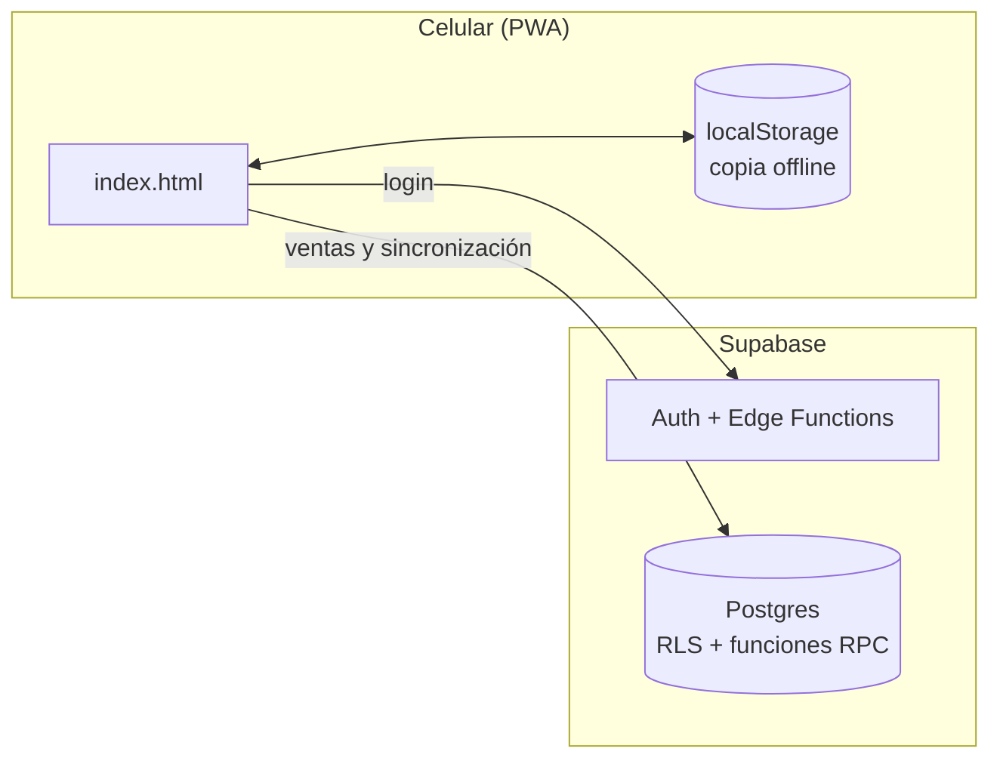
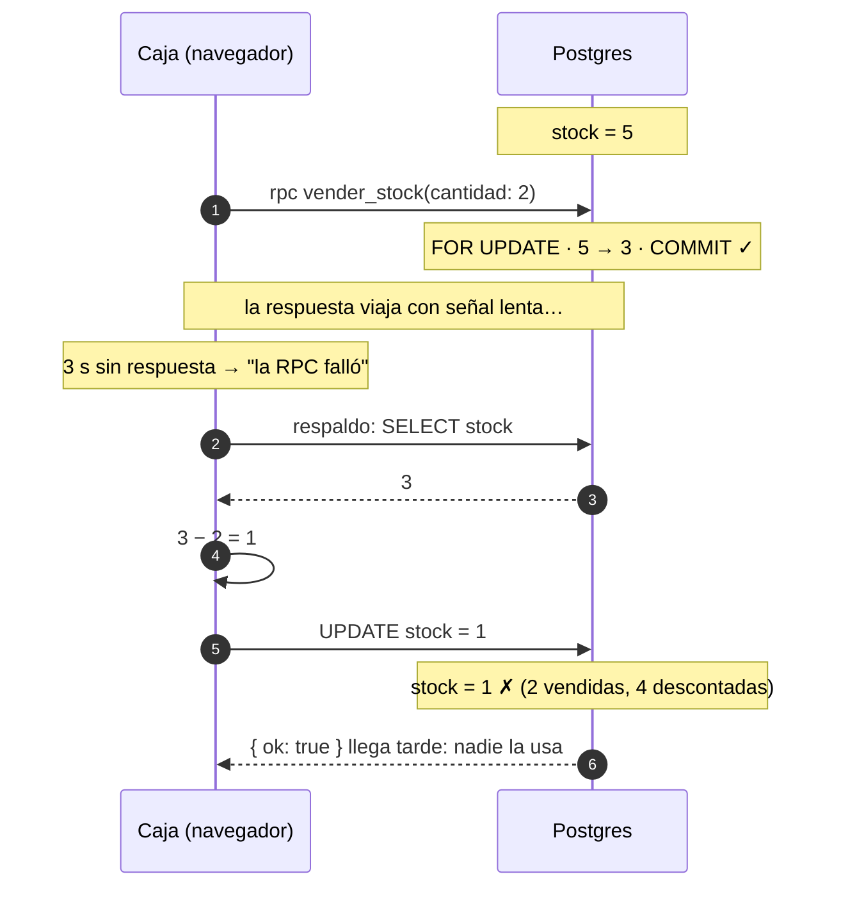

# POS offline-first para comercio de barrio

Un punto de venta pensado para almacenes y bazares atendidos por una o dos
personas, que venden **desde el celular**, sin computador en el mesón y con
una señal móvil que va y viene.

> Este repositorio es una versión pública del proyecto, para mostrar el
> diseño y el código. La URL del proyecto de Supabase, la llave publicable y
> la llave VAPID son valores de ejemplo (`TU-PROYECTO-REF`,
> `sb_publishable_TU_LLAVE_AQUI`, `TU_VAPID_PUBLIC_KEY`): no apunta a ninguna
> base de datos real.

## Qué hace

- **Caja:** ventas con efectivo, débito, crédito, transferencia, fiado o pago
  mixto; cálculo de vuelto; apertura y cierre de turno con arqueo.
- **Inventario con costo real:** cada compra entra como un lote y las ventas
  los consumen en orden FIFO, así la utilidad se calcula con el costo de lo que
  realmente se vendió. Escáner de códigos con la cámara y alertas de stock bajo.
- **Clientes y fiado:** el "cuaderno" de deudas, digital, con abonos.
- **Reportes** y exportación a Excel.
- **Funciona sin internet:** se puede seguir vendiendo sin señal y todo se
  sincroniza al volver la conexión.
- **Aviso al celular de la dueña** con cada venta (Web Push).
- **Dos roles:** administradora (todo) y vendedora (solo ventas y caja).

## Arquitectura

No hay servidor propio ni proceso de build: la app es un solo `index.html`
(HTML, CSS y JavaScript sin frameworks) que se instala como PWA en el celular.
El backend es Supabase.



- **Hosting:** cualquier hosting estático (el proyecto original usa
  Cloudflare Pages).
- **Datos:** el catálogo, los clientes, los lotes, los turnos y los usuarios
  viven como arreglos JSON en una tabla clave/valor (`app_data`). El historial
  de ventas y movimientos va en tablas propias, una fila por registro, donde
  solo se agregan filas.

### Cómo funciona sin internet

Cada dispositivo guarda una copia de los datos en `localStorage`. Cuando hay
conexión, cada cambio se sube con **bloqueo optimista** (`updated_at`): si otro
dispositivo escribió primero, se vuelve a leer y se **fusiona**.

La fusión es a tres vías: compara la versión local, la de la nube y la última
versión sincronizada (la "base"), y cada dispositivo aporta solo los campos que
cambió. Los campos que se acumulan (stock, saldo de fiado, cantidad restante de
un lote) se **suman** en vez de pisarse: si dos cajas vendieron a la vez, se
cuentan las dos ventas.

## Seguridad

La llave publicable de Supabase va en el navegador; es pública por diseño. Lo
que protege los datos está en la base:

- **Sesiones reales.** El login se ve simple (eliges tu nombre y escribes tu
  clave), pero la clave la valida en el servidor la Edge Function
  `iniciar-sesion`, con bloqueo tras 5 intentos. Si es correcta, entrega una
  sesión de Supabase Auth cuyo token lleva el id de la persona en
  `app_metadata`, un campo que solo el servidor puede escribir.
- **El rol lo decide la base.** En cada consulta, `fn_rol_actual()` busca el
  rol de quien llama en la lista de usuarios. Si la administradora desactiva a
  alguien, pierde el acceso en ese momento.
- **RLS por rol.** Sin sesión solo se puede leer la lista de nombres que
  muestra el login. La vendedora solo escribe lo que usan una venta y la caja;
  el resto, solo la administradora. Un trigger impide que alguien que no es
  administradora cree usuarios o cambie roles, aunque escriba directo a la API.
- **Claves.** Se guardan con PBKDF2 en tablas sin acceso desde la API.
  Cambiar una clave exige sesión. Para recuperar el acceso (pregunta secreta,
  código maestro o código por correo/SMS), la prueba viaja **junto** con la
  clave nueva y el servidor la vuelve a validar antes de guardarla.
- **Límite de llamadas** en las funciones expuestas.

El detalle y las pruebas están en
`supabase/migrations/20260101000009_autenticacion_real.sql`.

## Problema abierto: concurrencia de una venta

Este es el problema que estoy documentando y resolviendo en público.

El stock se descuenta en el servidor con `SELECT … FOR UPDATE`, que pone en
fila las ventas simultáneas. Pero el navegador espera esa respuesta solo 3
segundos (`Promise.race`). Si se agota, asume que falló y descuenta el stock
por un camino de respaldo. Como `Promise.race` no cancela la petición, el
servidor puede haber hecho `COMMIT` igual: **una venta, dos descuentos.**



**Reproducido:** con la app publicada y la respuesta de la RPC retrasada 6
segundos, un producto con stock 10 quedó en 6 después de vender 2 unidades.
La base registró una sola venta y un solo movimiento.

El código está en `index.html`: `descontarStockAtomico` (el timeout) y
`procesarVenta` (el camino de respaldo).

### Otros problemas encontrados en el mismo flujo

1. **Lotes FIFO fuera del bloqueo.** El costo se calcula en el navegador
   (`consumirFIFO`), tanto en una venta como en un ajuste de salida (merma).
   Dos salidas simultáneas del mismo producto consumen el mismo lote; al
   fusionar, ese lote queda negativo y la utilidad sale mal.
2. **La venta no es atómica.** Son varias escrituras independientes (stock,
   lotes, fiado, venta, movimientos). Si una falla, el resto queda aplicado
   hasta que el reintento la complete.
3. **Sobreventa escondida.** Al sincronizar ventas hechas sin internet, la
   fusión deja en 0 cualquier stock negativo, sin avisar.
4. **Validación del servidor.** La interfaz agrupa productos repetidos y no
   permite cantidades de 0 o menos, pero `vender_stock` no lo valida si se la
   llama directamente.

### Plan de solución

1. **Una función `registrar_venta`** que, en una sola transacción, inserte la
   venta y sus movimientos, descuente el stock, consuma los lotes FIFO
   (calculando el costo en el servidor) y sume el fiado. Todo o nada.
2. **Idempotencia por id de venta.** El id ya se genera en el dispositivo. Si
   la misma venta llega dos veces, el servidor devuelve el resultado guardado
   en vez de aplicarla de nuevo. Ante un timeout se reintenta la misma
   llamada; desaparece el camino de respaldo.
3. **Un solo escritor por dato.** Si el servidor mueve el stock, los lotes y
   el saldo de una venta, la sincronización deja de subir esos cambios. Si no,
   se volverían a contar.
4. **Ventas sin internet como una cola de eventos,** cada una con su id, que
   se envían a la misma función al reconectar. Una venta offline ya ocurrió:
   se acepta aunque deje el stock negativo y queda marcada para revisión, en
   vez de esconderse en 0.
5. **Toda salida de inventario consume lotes en el servidor,** también los
   ajustes por merma.
6. **Validación en el servidor:** cantidades mayores a 0 y líneas repetidas
   agrupadas.
7. **Pruebas** con ventas concurrentes, timeouts forzados y reintentos.

A futuro, por escala y no por corrección: pasar el stock de un JSON a filas,
para no bloquear todo el catálogo en cada venta. Con una o dos cajas, el
bloqueo de una sola fila no es un cuello de botella.

## Backend

### Migraciones

En `supabase/migrations/`, en orden:

| # | Migración | Qué hace |
|---|---|---|
| 001 | `esquema_base` | Tablas, funciones de credenciales (PBKDF2 con bloqueo por intentos) y respaldo diario. |
| 002 | `codigo_maestro` | Saca el código maestro de `app_data` y lo guarda hasheado. |
| 003 | `limites_e_indices` | Límite de llamadas por IP e índices del historial. |
| 004 | `vender_stock` | Descuento de stock atómico con `FOR UPDATE`. |
| 005 | `rls` | Primera limpieza de políticas RLS. |
| 006 | `endurecimiento` | Cierra funciones que la app no usa y programa limpiezas. |
| 007 | `recuperacion_otp` | Recuperación de clave con código por correo o SMS. |
| 008 | `notificaciones_push` | Aviso push a la administradora en cada venta. |
| 009 | `autenticacion_real` | Sesiones de Supabase Auth, RLS por rol y credenciales protegidas. |

### Funciones que usa la app

| Función | Qué hace |
|---|---|
| Edge Function `iniciar-sesion` | Valida la clave (o la prueba de recuperación junto con la clave nueva) y entrega la sesión. |
| `vender_stock(items)` | Descuento de stock atómico. Todo o nada. Requiere sesión. |
| `verificar_credencial(usuario, tipo, valor)` | Valida una clave, respuesta secreta o código maestro, con bloqueo tras 5 intentos. |
| `guardar_credencial(usuario, tipo, valor)` | Cambia una clave o respuesta. La administradora puede cambiar cualquiera; el resto, solo la propia. |
| `eliminar_credencial(usuario)` | Elimina las credenciales de una persona. Solo administradora. |
| `rpc_registrar_contacto_recuperacion(usuario, canal, destino)` | Guarda el correo o teléfono de recuperación. La administradora, o la propia persona. |
| `rpc_canales_disponibles(usuario)` | Dice si hay correo o teléfono registrado (nunca el destino). |
| `rpc_generar_codigo_recuperacion(usuario, canal)` | Genera un código de 6 dígitos que vence en 10 minutos. El destino lo elige el servidor. |
| `rpc_verificar_codigo_recuperacion(usuario, codigo)` | Valida el código (4 intentos fallidos como máximo). |
| `rpc_sembrar_inicial(usuarios, credenciales)` | Primera instalación: crea los usuarios iniciales. Solo funciona si no existe ninguno. |
| `guardar_suscripcion_push` / `eliminar_suscripcion_push` | Activa o desactiva los avisos de venta en un dispositivo. |

Las funciones de respaldo, restauración y limpieza no se pueden llamar desde
la API: las ejecuta `pg_cron` o se usan desde el SQL Editor.

### Respaldos

Un cron copia `app_data` todos los días y conserva 14 días. No incluye el
historial de ventas, así que la app también permite descargar un respaldo
completo desde Ajustes. Restaurar: `select fn_restaurar_respaldo(<id>);`

### Recuperar la clave por correo o SMS

El envío lo hace la Edge Function `despachar-otp`. Necesita `RESEND_API_KEY`
para correo y, opcionalmente, las credenciales de Twilio para SMS, como
secrets del proyecto. Sin ellas, la app muestra un error claro en vez de
fallar en silencio.

### Avisos push

Necesitan la Edge Function `notificar-venta`, un par de llaves VAPID (la
pública va en `index.html`, la privada como secret) y un `WEBHOOK_SECRET`
guardado en Supabase Vault y como secret de la función. En iPhone, Web Push
solo funciona con la app agregada a la pantalla de inicio (iOS 16.4 o superior).

## Correr en local

Requiere Docker y la [CLI de Supabase](https://supabase.com/docs/guides/local-development).

```bash
supabase start      # levanta Postgres, Auth, Edge Functions y Studio
supabase db reset   # aplica las 9 migraciones sobre una base limpia
supabase functions serve
```

Luego cambia `SUPABASE_URL` y `SUPABASE_KEY` al inicio de `index.html` por
los que muestra `supabase status`, y sirve el archivo con cualquier servidor
estático (por ejemplo, `npx serve .`). La primera vez que abras la app se
crean dos usuarios de prueba: **Admin** (clave `1234`) y **Operario** (clave
`x`). Cámbialas al entrar.

## Decisiones de diseño mobile-first

La mayor parte del uso real es desde el celular de quien atiende la caja:

- `viewport-fit=cover` y `env(safe-area-inset-*)` para respetar el notch y la
  barra de inicio.
- Todo campo de monto o cantidad usa `inputmode="numeric"`.
- El carrito y los buscadores se actualizan por partes, sin volver a dibujar
  toda la pantalla, para no perder el foco ni cerrar el teclado.
- Los modales se cierran arrastrando hacia abajo, y todas las animaciones
  respetan `prefers-reduced-motion`.
- El scroll vive en `body` y `#app-root` usa `overflow-x: clip`: con `hidden`
  se rompería la barra superior fija (`position: sticky`).

## Estructura

```
index.html                  la app completa (HTML, CSS y JS)
sw.js                       service worker (solo avisos push)
supabase/
  config.toml               configuración para correr el backend en local
  migrations/               esquema, funciones y políticas, en orden
  functions/
    iniciar-sesion/         login: valida la clave y entrega la sesión
    despachar-otp/          envía el código de recuperación por correo o SMS
    notificar-venta/        envía el aviso push de cada venta
```
